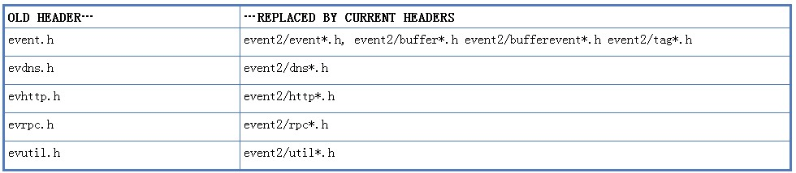

## （一）前言

### 1  从一万英尺外看Libevent

Libevent是用于编写高速可移植非阻塞IO应用的库，其设计目标是：

* 可移植性：使用libevent编写的程序应该可以在libevent支持的所有平台上工作。即使没有好的方式进行非阻塞IO，libevent也应该支持一般的方式，让程序可以在受限的环境中运行。
* 速度：libevent尝试使用每个平台上最高速的非阻塞IO实现，并且不引入太多的额外开销。
* 可扩展性：libevent被设计为程序即使需要上万个活动套接字的时候也可以良好工作。
* 方便：无论何时，最自然的使用libevent编写程序的方式应该是稳定的、可移植的。
 
libevent由下列组件构成：

* evutil：用于抽象不同平台网络实现差异的通用功能。
* event和event_base：libevent的核心，为各种平台特定的、基于事件的非阻塞IO后端提供抽象API，让程序可以知道套接字何时已经准备好，可以读或者写，并且处理基本的超时功能，检测OS信号。
* bufferevent：为libevent基于事件的核心提供使用更方便的封装。除了通知程序套接字已经准备好读写之外，还让程序可以请求缓冲的读写操作，可以知道何时IO已经真正发生。（bufferevent接口有多个后端，可以采用系统能够提供的更快的非阻塞IO方式，如Windows中的IOCP。）
* evbuffer：在bufferevent层之下实现了缓冲功能，并且提供了方便有效的访问函数。
* evhttp：一个简单的HTTP客户端/服务器实现。
* evdns：一个简单的DNS客户端/服务器实现。
* evrpc：一个简单的RPC实现。

### 2  库

创建libevent时，默认安装下列库：

* libevent_core：所有核心的事件和缓冲功能，包含了所有的event_base、evbuffer、bufferevent和工具函数。
* libevent_extra：定义了程序可能需要，也可能不需要的协议特定功能，包括HTTP、DNS和RPC。
* libevent：这个库因为历史原因而存在，它包含libevent_core和libevent_extra的内容。不应该使用这个库，未来版本的libevent可能去掉这个库。

某些平台上可能安装下列库：

* libevent_pthreads：添加基于pthread可移植线程库的线程和锁定实现。它独立于libevent_core，这样程序使用libevent时就不需要链接到pthread，除非是以多线程方式使用libevent。
* libevent_openssl：这个库为使用bufferevent和OpenSSL进行加密的通信提供支持。它独立于libevent_core，这样程序使用libevent时就不需要链接到OpenSSL，除非是进行加密通信。

### 3 头文件

libevent公用头文件都安装在event2目录中，分为三类：

* API头文件：定义libevent公用接口。这类头文件没有特定后缀。
* 兼容头文件：为已废弃的函数提供兼容的头部包含定义。不应该使用这类头文件，除非是在移植使用较老版本libevent的程序时。
* 结构头文件：这类头文件以相对不稳定的布局定义各种结构体。这些结构体中的一些是为了提供快速访问而暴露；一些是因为历史原因而暴露。直接依赖这类头文件中的任何结构体都会破坏程序对其他版本libevent的二进制兼容性，有时候是以非常难以调试的方式出现。这类头文件具有后缀“_struct.h”。
（还存在不在event2目录中的较老版本libevent的头文件，请参考下节：如果需要使用老版本libevent）

### 4 如果需要使用老版本libevent

libevent 2.0以更合理的、不易出错的方式修正了API。如果可能，编写新程序时应该使用libevent 2.0。但是有时候可能需要使用较老的API，例如在升级已存的应用时，或者支持因为某些原因不能安装2.0或者更新版本libevent的环境时。

较老版本的libevent头文件较少，也不安装在event2目录中。

在2.0以及以后版本的libevent中，老的头文件仍然会作为新头文件的封装而存在。

其他关于使用较老版本的提示：

* 1.4版之前只有一个库libevent，它包含现在分散到libevent_core和libevent_extra中的所有功能。
* 2.0版之前不支持锁定：只有确定不同时在多个线程中使用同一个结构体时，libevent才是线程安全的。

下面的节还将讨论特定代码区域可能遇到的已经废弃的API。

### 5 关于版本状态的提示

1.4.7及以前版本应该被认为是完全废弃的。1.3之前的版本应该被认为是充满bug的。
（此外，不要向libevent维护者发送任何关于1.4.x或者更早版本的新特征，这些版本被认为是稳定的发布版本。如果在1.3x或者更早版本中发现bug，在报告之前请确定在最新的稳定发布版本中问题仍然存在：后续发布可能已经解决了问题。）